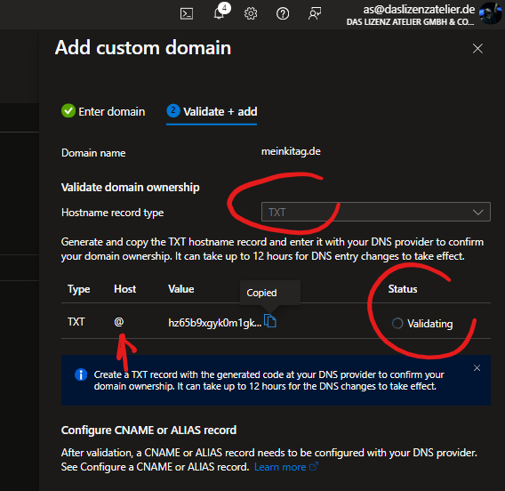
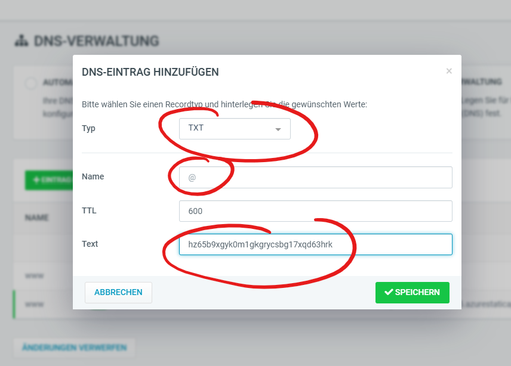

# Azure Custom Domain setup
- Go to "Custom Domain" in your Azure WebApp and select **add**
- lege zuerst eine Root Domain (also ohne www.) mit dem Record type **TXT** an. Die Validierung kann eine Weile dauern.

- Azure prüft des Status und gibt dann ein OK aus, sodass Du den Value kopieren kannst.

